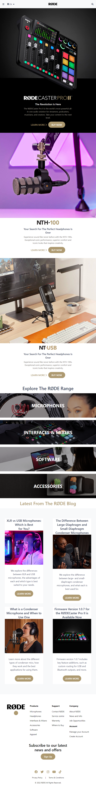

# Rode-clone-TailwindCSS

### Built with

- HTML
- TailwindCSS

### Screens : **1280px** , **1200px** , **768px** , **480px**

This entire project was built using **TailwindCSS** . Everything was learnt by reading DOCS from official Tailwindcss website.

Apart from official website , a youtube video from **Traversy Media** channel helped me a lot .

Here is the link of that video : [**Click Here**](https://youtu.be/dFgzHOX84xQ)

### What i learnt :

- Utility-classes
- Media query (screens : sm, md, lg, xl )
- Adding Background images using utility class

### Time Taken :

- 18+ hours (this looks easy but this took more time to build compared to Paytm & Shopify clones)
- For me, took lot of time to figure out how to add background image .

### Live Link : [**Click Here**](https://rode-clone-tailwind-css.vercel.app/)

### Output :

**Large Screen**

**Medium Screen**

**Small Screen**

